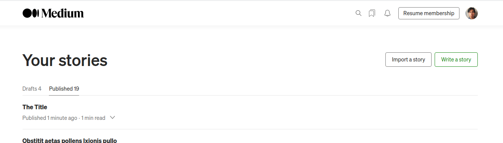
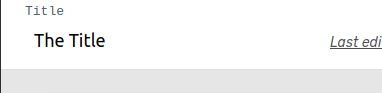

# MWriter

A journaling application that publishes directly to Medium. Organize your Medium journal entries, and also automate Gist creations from coding snippets.

# What is the format that of note that gets published?

The title => becomes the name of the file.

### TODO
TODO: Show publishing status when the publish button is hit--let users know publishing is taking place, make button unclickable.
TODO: Allow ordering of notes.. by updatedAt, by createdAt?
TODO: Keep track of last Saved note in the database in the user model not in localStorage.
TODO: Note Title should also create set loading icon when being saved
TODO: Need a readme for how to publish a Medium entry

