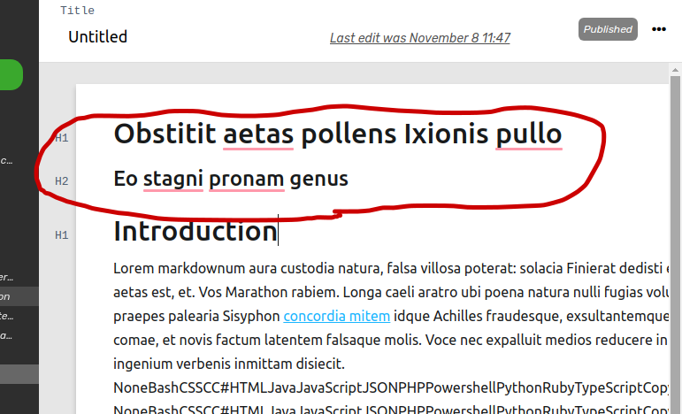

# MWriter

A journaling application that publishes directly to Medium. Organize your Medium journal entries, and also automate Gist creations from coding snippets.

# How to Format your MWriter Post for Medium

_Notes can only be published to Medium once. If you want to edit your Medium article after it's been published, you can only do it on Medium. (Medium's Third party API doesn't allow for editing posts yet)._

## File Name

The **title** of the MWriter note becomes the **name** of the file on Medium.

## Title and Subtitle

The **first header 1** of note becomes the **title** of the post on Medium.
The next **header 2** of note becomes the **subtitle** of the post.

_NOTE: If you want a subtitle you need to have a title. You must use the exact header type (H1 and H2) for title and subtitle._

## Headers

Any other **Header 1** headers in the note become Header 1's in the post. Any other **Header 2 and Header 3** headers become Header 2's in the post.

## Code Snippets become Gists

Any **code snippets** will become a **gist** in the Medium article.

### TODO

CURRENTLY working on this one
- TODO: Allow ordering of notes.. by updatedAt, by createdAt?
- TODO: Add Readme link that links to GitHub
- TODO: When user first creates their account there should be an untitled note in the first Notebook, that automatically opens up...
- TODO: Should be able to move notes to different notebook?
- TODO: Reorganize all the components into proper folders
- TODO: In production use https for API?

