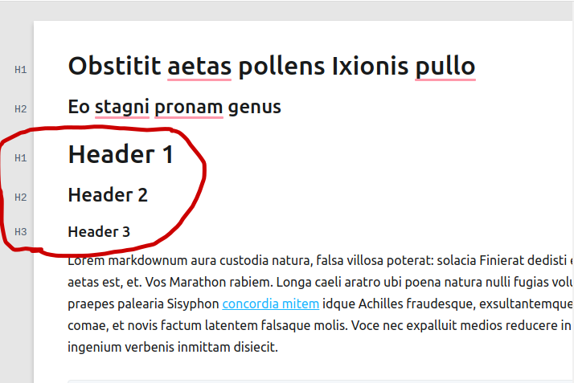
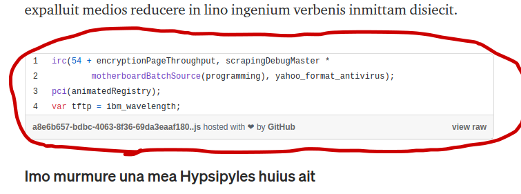

# MWriter

A journaling application that publishes directly to Medium. Organize your Medium journal entries, and also automate Gist creations from coding snippets.

# How to Format your MWriter Post for Medium

## File Name

The **title** of the MWriter note becomes the **name** of the file on Medium.

## Title and Subtitle

The **first header 1** of note becomes the **title** of the post on Medium.
The next **header 2** of note becomes the **subtitle** of the post.

_NOTE: If you want a subtitle you need to have a title. You must use the exact header type (H1 and H2) for title and subtitle._

## Headers

Any other **Header 1** headers in the note become Header 1's in the post. Any other **Header 2 and Header 3** headers become Header 2's in the post.

## Code Snippets become Gists

Any **code snippets** will become a **gist** in the Medium article.

### TODO
- TODO: Show publishing status when the publish button is hit--let users know publishing is taking place, make button unclickable.
- TODO: Allow ordering of notes.. by updatedAt, by createdAt?
- TODO: Keep track of last Saved note in the database in the user model not in localStorage.
- TODO: Note Title should also create set loading icon when being saved
- TODO: Need a readme for how to publish a Medium entry

